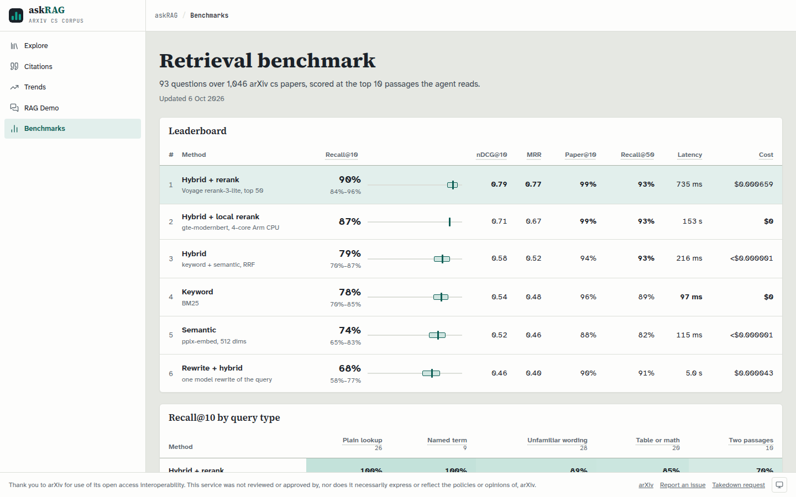

# askRAG

Agentic RAG over a sample of arXiv computer science papers. An agent in a side
panel answers questions by calling tools (hybrid search, metadata queries,
paper reading, sandboxed Python, UI driving) on a hand-built loop, and quotes
what it read, never more than 50 words at a time.

## What is in it

- **RAG Demo** (`/demo`): 1,046 indexed papers, a PDF reader, and the agent
  panel beside them.
- **Explore** (`/`): a filterable list over all 78,024 catalog rows.
- **Citations** (`/citations`) and **Category trends** (`/trends`): what the
  sample cites most, and arXiv's own category counts by month.
- **Benchmarks** (`/benchmarks`): the retrieval eval below, per method, per
  question type and per query.

Retrieval is BM25 and dense vectors fused with reciprocal rank fusion, then
reranked by Voyage rerank-3-lite over the top 50. Every number on the
benchmarks page comes from a committed eval run.

## Layout

| Path | What it holds |
|---|---|
| `backend/` | FastAPI app, the agent loop and its tools, ingest (chunk, embed, index) |
| `frontend/` | Next.js static export: the pages above |
| `evals/` | Golden set, retrieval eval runner, the committed run |
| `collector/` | Corpus acquisition from the Kaggle arXiv snapshot and the Google-hosted PDF mirror |
| `deploy/` | Docker Compose for the API and Caddy; runbook in [`deploy/README.md`](deploy/README.md) |
| `docs/` | Design spec, architecture map, mockups |

The design spec is the source of truth:
[`docs/superpowers/specs/2026-07-04-agentic-rag-design.md`](docs/superpowers/specs/2026-07-04-agentic-rag-design.md),
with its decision log in [`DECISIONS.md`](DECISIONS.md). The project was built
with coding agents; their contract is [`CLAUDE.md`](CLAUDE.md).

## Running it

Needs [uv](https://docs.astral.sh/uv/), [pnpm](https://pnpm.io/),
[just](https://github.com/casey/just), Docker, and an
[OpenRouter](https://openrouter.ai/) key.

1. Build a corpus: `just setup`, then the collector recipes in
   [`collector/README.md`](collector/README.md), then `just text`, `just
   citations`, `just frontier` and `just index`. Data lands in `corpus/`,
   which is never committed.
2. `cp deploy/.env.example deploy/.env` and fill it in.
3. `just deploy` serves the app on `127.0.0.1:8420`.

`just check` runs the full lint, type and test gate, the same one CI runs.

## Retrieval evals

Generated by `just eval-publish` from the committed run (D14, #18). Recall@k is the share of
each question's expected chunks in the top k; paper recall counts any chunk of
the expected paper.

<!-- retrieval-evals:start -->
93 golden questions, drafted by one model and checked by another (D14 amendment 2026-09-30), over 1,046 indexed papers and 51,932 chunks, scored at the top 10 the agent reads. Run `0a4464659e57`.

| Retrieval | Recall@10 | nDCG@10 | MRR | Paper recall@10 | Recall@50 | p50 latency | Cost / query |
|---|---|---|---|---|---|---|---|
| Hybrid + rerank | 90% | 0.79 | 0.77 | 99% | 93% | 735 ms | $0.000659 |
| Hybrid (RRF) | 79% | 0.58 | 0.52 | 94% | 93% | 216 ms | <$0.000001 |
| Keyword (BM25) | 78% | 0.54 | 0.48 | 96% | 89% | 97 ms | $0 |
| Semantic (vector) | 74% | 0.52 | 0.46 | 88% | 82% | 115 ms | <$0.000001 |
| Rewrite + hybrid | 68% | 0.46 | 0.40 | 90% | 91% | 5040 ms | $0.000043 |

Recall@10 by question type:

| Question type | n | Hybrid + rerank | Hybrid (RRF) | Keyword (BM25) | Semantic (vector) | Rewrite + hybrid |
|---|---|---|---|---|---|---|
| single_hop | 26 | 100% | 100% | 96% | 92% | 85% |
| exact_match | 9 | 100% | 89% | 100% | 78% | 89% |
| multi_hop | 10 | 70% | 55% | 45% | 60% | 60% |
| known_hard | 20 | 85% | 80% | 75% | 70% | 60% |
| vocabulary_mismatch | 28 | 89% | 64% | 68% | 64% | 54% |

vocabulary_mismatch questions may not use any word of their passage that appears in 500 or fewer chunks, so keyword search can match them only on common field words.

Recall@50 is the most a reranker reordering the top 50 into the top 10 could reach. Rewrite + hybrid searches one model rewrite of the question; its latency includes the rewrite call. Hybrid + rerank reorders hybrid's top 50 with voyageai/rerank-3-lite through OpenRouter; its latency includes retrieving that pool.

One question is 1.1 points at this size, so gaps under about 5 points are noise. Latency is the median per question on a 4-core Arm server (Neoverse N1), no GPU; the semantic leg includes the embedding API call. Cost is the mean per question that the providers billed: the embedding, the rerank and the rewrite call.
<!-- retrieval-evals:end -->

## Papers and license

The code is MIT licensed (see [`LICENSE`](LICENSE)). It depends on PyMuPDF,
which is AGPL-3.0, so a running copy of the app must offer users its source;
[`NOTICE`](NOTICE) says how. The papers are not part
of this repo and keep their own licenses: the app reads them from arXiv's
public mirror, links PDFs to arxiv.org at a pinned version, and quotes at
most 50 words, three times per paper, per answer. The golden set commits
questions and chunk ids, not passage text.

Thank you to arXiv for use of its open access interoperability.
